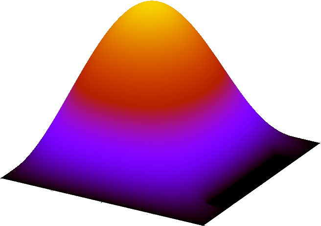
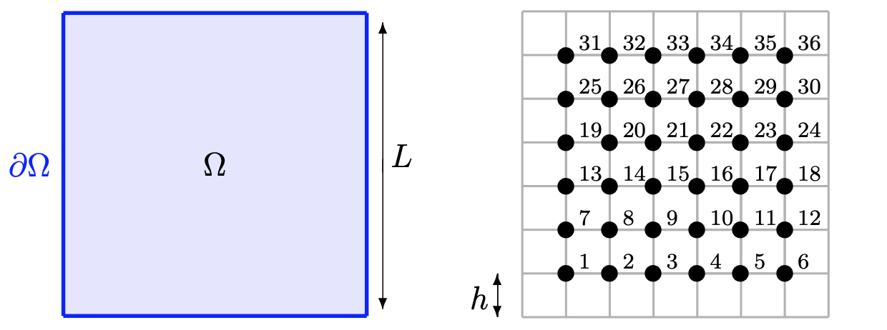

# PoissonSolver

## Introduction

This project presents a numerical solution to the two-dimensional Poisson equation using a C program. The solution involves defining arbitrary membrane shapes, discretizing the domain, and employing a Multi-Grid method for iterative problem-solving. Further, the project explores the optimization of the algorithm through a relaxation parameter and enhances solver performance using a Multi-Grid preconditioner with the PRIMME solver.

## Program Structure
The program is structured into 20 files, each dedicated to specific functions. The main file, *main.c*, offers four distinct options:

- **The first option** includes a *two-grid method* originally designed for a particular problem, though the second and third options can also implement this method.
- **The second option** enables the use of a *multi-grid solver* that can operate in either V or W cycles, with a variable number of levels.
- **The third option** establishes a *multi-grid preconditioner* that, at the end of each iteration, applies a correction to the solution, incorporating a *relaxation factor*, and calculates both the minimum/maximum eigenvalues and the optimal relaxation factor. It also checks the algorithm's direct stability.
- **The fourth option** employs the *PRIMME solver* to tackle an eigenvalue problem, with the *multi-grid preconditioner* enhancing the solver's convergence rate.

## Discretization
The project involves solving the Poisson equation for a given membrane $\Omega \subset \mathbb{R}^2$, with boundary conditions specified on $\partial \Omega$. The domain is discretized, and the solution $u$ at each grid point is approximated using the finite difference method, leading to a linear system $Au = b$.

## Multi-Grid Method
The Multi-Grid method enhances solution convergence through pre-/post-smoothing iterations and corrections on coarser grids. The method's effectiveness and the impact of various smoothing iterations on convergence are demonstrated.

## Preconditioning with Multi-Grid
The use of a Multi-Grid preconditioner with the PRIMME solver for eigenvalue problems showcases significant improvements in solver performance.

## Conclusion
The project effectively demonstrates the application of the Multi-Grid method to solve the 2D Poisson equation and optimize eigenvalue problem solving with the PRIMME solver.
