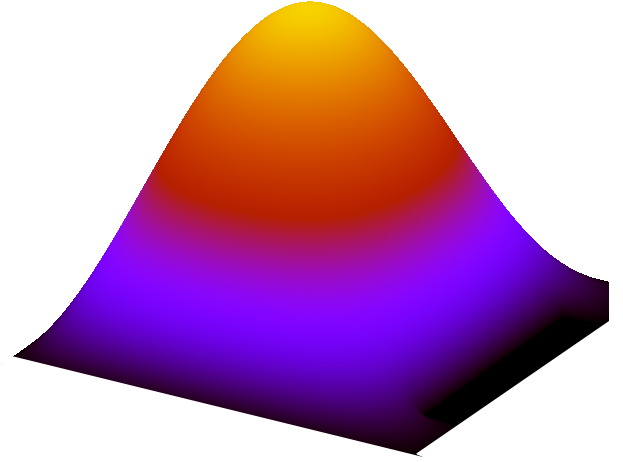

# PoissonSolver

## Introduction

This project presents a numerical solution to the two-dimensional Poisson equation using a C program. The solution involves defining arbitrary membrane shapes, discretizing the domain, and employing a Multi-Grid method for iterative problem-solving. Further, the project explores the optimization of the algorithm through a relaxation parameter and enhances solver performance using a Multi-Grid preconditioner with the <a href="https://www.cs.wm.edu/~andreas/software/">PRIMME</a> solver.

## Program Structure
The program is structured into 20 files, each dedicated to specific functions. The main file, `main.c`, offers four distinct options:

- **The first option** includes a *two-grid method* originally designed for a particular problem, though the second and third options can also implement this method.
- **The second option** enables the use of a *multi-grid solver* that can operate in either V or W cycles, with a variable number of levels.
- **The third option** establishes a *multi-grid preconditioner* that, at the end of each iteration, applies a correction to the solution, incorporating a *relaxation factor*, and calculates both the minimum/maximum eigenvalues and the optimal relaxation factor. It also checks the algorithm's direct stability.
- **The fourth option** employs the *PRIMME solver* to tackle an eigenvalue problem, with the *multi-grid preconditioner* enhancing the solver's convergence rate.

## Discretization
The project involves solving the Poisson equation for a given membrane $\Omega \subset \mathbb{R}^2$, with Dirichlet boundary conditions specified on $\partial \Omega$.

$$
\begin{cases}
  \begin{aligned} 
    -\Delta u &= 0 &&\text{on} &&&\Omega \subset \mathbb{R}^2\\ 
    u &= e^{\sqrt{x^2+y^2}} &&\text{on} &&&\partial \Omega\\ 
  \end{aligned}
\end{cases}
$$

The domain is discretized with a discretization step $h = \frac{L}{m-1}$ where $L$ is the length of one side of the square membrane and $m$ is the number of points aligned in one direction of the grid. Thus, each of the grid points is defined as follows:

$$
\begin{aligned}
    (x_i,y_j) &= (ih,jh) &&\text{with} &&&i,j = 1,...,m-2
\end{aligned}
$$

The approximation of the solution $u$ is calculated at each of the points belonging to the interior of the domain $\Omega$ according to the finite difference:

$$
    \frac{4u_{i,j} - u_{i+1,j} - u_{i-1,j} - u_{i,j+1} - u_{i,j-1}}{h^2} = 0 + \mathcal{O}(h^2)
$$

where the edges of the domain are not taken into account because $u$ is already known there due to Dirichlet boundary conditions.
By gathering all the equations, we obtain the following linear system:

$$
    Au = b
$$

where $b$ is a null vector to which Dirichlet boundary conditions have been added.

## Multi-Grid Method Algorithm
The **multi-grid method** is an efficient numerical approach for solving differential equations, leveraging multiple levels of grid resolution. The core idea behind the two-grid algorithm is to perform most computational steps inexpensively, with the exception of solving with the <a href="https://people.engr.tamu.edu/davis/research.html">UMFPACK</a> direct solver on the coarse grid. The multi-grid method enhances this by iteratively applying pre-smoothing and post-smoothing on progressively coarser grids (each new coarse grid doubles the discretization step of the old grid, $h_{new} = 2 h_{old}$, until a grid is coarse enough for the problem $u_c = A_c^{-1} r_c$ to be solved directly, significantly reducing computational costs.

However, this method involves certain trade-offs. Moving to coarser grids and employing direct solvers decreases execution costs, but successive corrections and prolongations (interpolating solutions from coarser to finer grids) can decelerate the algorithm's convergence. Moreover, the efficacy of direct solutions on coarser grids lessens as the discretization step increases, leading to less effective error correction at lower frequencies. This results in a slower convergence rate of the multi-grid algorithm as the number of levels increases, a phenomenon observable in convergence studies.

In this specific case, the **Gauss-Seidel symmetric** iterative method is chosen for pre-smoothing and post-smoothing phases.

The algorithm follows these steps :
```pseudo
FOR i = 0 to N
    - Apply ν1 pre-smoothing on A1u = b -> u1
    - Reduce the residue r2 = R1(b - A1u1)
        - Apply ν1 pre-smoothing on A2c = r2 -> c2
        - Reduce the residue r3 = R2(r2 - A2c2)
            - Apply ν1 pre-smoothing on A3c = r3 -> c3
            - Reduce the residue r4 = R3(r3 - A3c3)
                - Solve on the coarse grid: c4 = A4^(-1)r4
            - Prolong the correction: c3_tilde = c3 + P3c4
            - Apply ν2 post-smoothing on A3c = r3 -> c3'
        - Prolong the correction: c2_tilde = c2 + P2c3'
        - Apply ν2 post-smoothing on A2c = r2 -> c2'
    - Prolong the correction: u1_tilde = u1 + P1c2'
    - Apply ν2 post-smoothing on A1u = b -> u1'
END FOR

